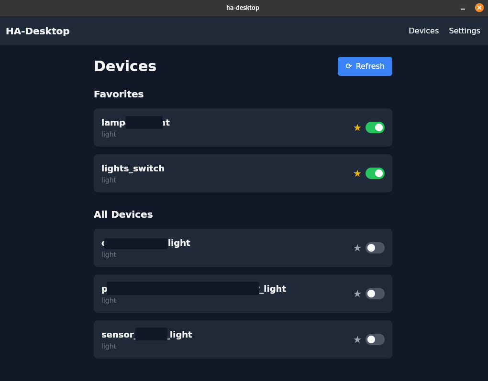
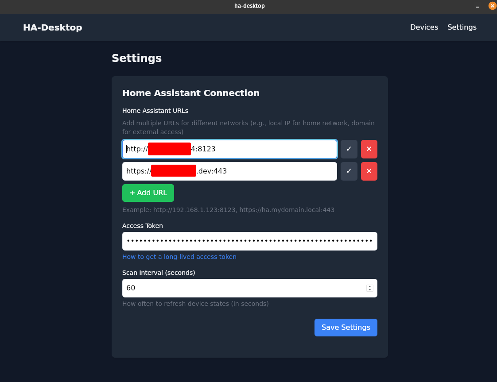
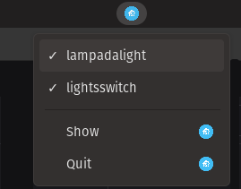

# HA-Desktop

A desktop application for quickly managing your Home Assistant lights from your system tray.





## Features

- Control your Home Assistant lights directly from your desktop
- Pin favorite devices for quick access
- System tray integration for easy access without opening the full app
- Settings persistence between sessions
- Simple and intuitive interface built with Svelte and Tailwind CSS

## About

HA-Desktop is built with Wails, combining Go and Svelte to create a fast, responsive desktop application. It leverages the Home Assistant API to provide seamless control of your smart home lighting.

## Configuration

1. Open the application
2. Navigate to the Settings page
3. Enter your Home Assistant URL and access token
4. Save your settings

## Getting Started

### Obtaining a Home Assistant Access Token

1. Log in to your Home Assistant instance
2. Navigate to your profile page
3. Scroll down to the "Long-Lived Access Tokens" section
4. Create a new token for HA-Desktop

## Development

### Prerequisites

- Go 1.23 or later
- Node.js and npm
- Wails CLI (`go install github.com/wailsapp/wails/v2/cmd/wails@latest`)

### Setup

1. Clone the repository
2. Install dependencies:
   ```
   cd frontend && npm install
   ```

### Live Development

To run in live development mode, run `wails dev` in the project directory. This will run a Vite development
server that will provide very fast hot reload of your frontend changes. If you want to develop in a browser
and have access to your Go methods, there is also a dev server that runs on http://localhost:34115. Connect
to this in your browser, and you can call your Go code from devtools.

### Building

To build a redistributable, production mode package, use `wails build`.

